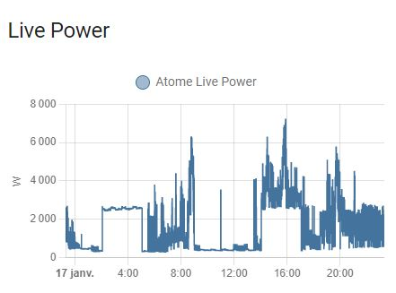

# KeyAtome

[](https://github.com/custom-components/hacs)

Home Assistant component to handle key atome, a Linky-compatible device made by Total/Direct-Energie.
Several key atome linky within an account can be managed.

Hereafter an example of history curve
<p align="center">
  
</p>


## Installation
Either use HACS (default), either manual
### [HACS](https://hacs.xyz/) (Home Assistant Community Store) 
1. Go to HACS page on your Home Assistant instance 
1. Select `integration` 
1. Press add icon and search for `keyatome` 
1. Select keyatome and install 

### Manual
<details><summary>Manual Procedure</summary>
  
1. Download the folder keyatome from the latest [release](https://github.com/jugla/KeyAtome/releases) (with right click, save 
link as) 
1. Place the downloaded directory on your Home Assistant machine in the `config/custom_components` folder (when there is no `custom_components` folder in the 
folder where your `configuration.yaml` file is, create it and place the directory there) 
1. restart HomeAssistant
</details>

## Using the component
**Use UI**

or

*deprecated method* in configuration.yaml, declare :

*Example of YAML*
  
```yaml
##configuration.yaml example
sensor:
  - platform: keyatome
    username: YOUR_ATOME_USERNAME
    password: YOUR_ATOME_PASSWORD
#    atome_linky_number : 1
#    name: Atome
```
where :
- atome_linky_number is optional (default is 1) and represents your linky within the account (1, 2, 3 ...) 
- name is optional (default value is Atome) and represents root name for sensor :
  - sensor.atome_... when atome_linky_number is one
  - sensor.atome_linky(number)_ when atome_linky_number is greater

**Check that *atome* of HomeAssistant is not activated (i.e. declared in configuration.yaml) to avoid too many request on Atome Server**

Several sensors are created (assumed that name given at configuration is atome with atome_linky_number is one) :
- *sensor.atome_live_power* with instant power (connection status, max subscription power)
- *sensor.atome_daily* with current daily consumption (in attributes current price, previous consumption, previous price)
- *sensor.atome_weekly* with current weekly consumption (in attributes current price, previous consumption, previous price)
- *sensor.atome_monthly* with current monthly consumption (in attributes current price, previous consumption, previous price)
- *sensor.atome_yearly* with current yearly consumption (in attributes current price, previous consumption, previous price)
- *sensor.atome_login_stat* with current user id, user ref (**this sensor is available since v5.0.0**)
- *sensor.atome_diagnostic* with synthetic state from server (cumulative_error) (**this sensor is available since v6.0.0**)
- 
(Please check the *sensor.atome_login_stat* to check is you have addressed the right linky in your user account)

## Typical use
You can use the sensor *sensor.atome_daily* to monitor electrcity energy consumption within energy dashboard.
To add price in dashboard, please in configuration.yaml add the following entity :

```yaml
template:
  - sensor:
      - name: atome_daily_price
        state: "{{ state_attr('sensor.atome_daily', 'price') | float }}"
        unit_of_measurement: 'EUR'
        state_class: total_increasing
        device_class: monetary
```


## Breaking changes
<details><summary>detail description</summary>

For release V0.0.1 and V1.0.0 : the name of sensor are `sensor.key_atome_xxx`

For release V2.0.0 : the name of sensor are `sensor.atome_xxx` (like HA atome component)

Since release V2.1.0 : the name of sensor are `sensor.NAME_xxx` where NAME is set during configuration (via UI or configuration.yaml). By default `Atome` to be consistent with HA.

Since release V4.1.0 : as several linky can be managed , for linky_ref above 1, the name of sensor are `sensor.NAME_linky(number)_xxx` where NAME is set during configuration.
  NB: for linky ref equal to 1, nothing is changed.
</details>

## Acknowledgments
* Thanks to the 1rst implementation performed by BaQs for Home Assistant.

The first version V0.0.1 reprensents the Atom component in Home Assistant 2021.12.4 (@baqs)
This library is a fork of this in order to implement new feature.


